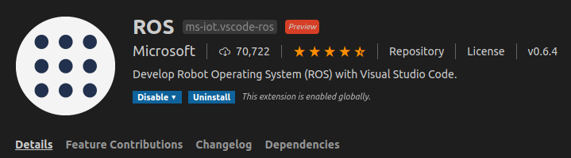
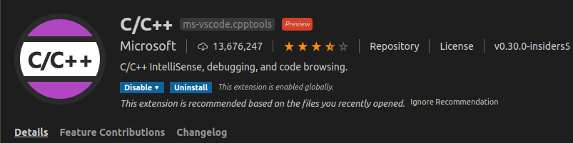
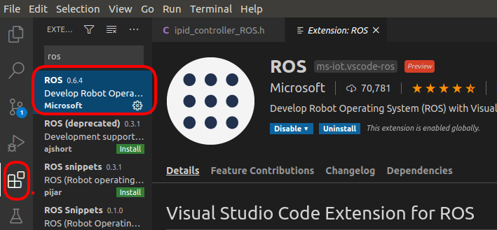
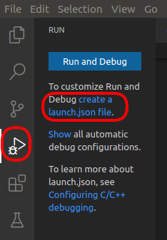
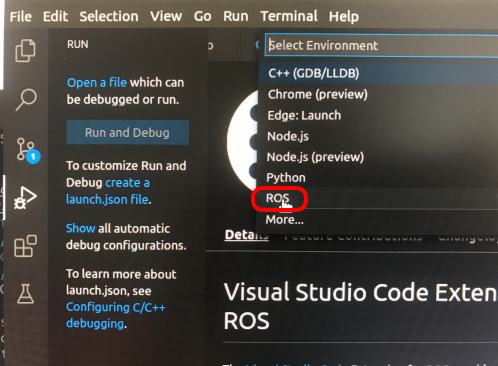
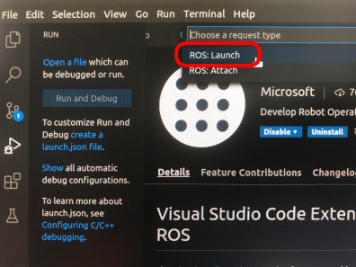
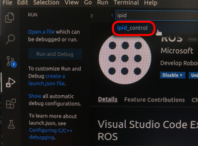
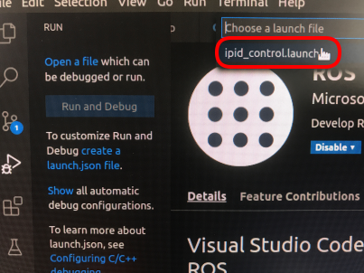

## Debug ROS using `VScode`

### Prerequisites
  - [VScode](https://code.visualstudio.com/)
  - [GDB](https://www.gnu.org/software/gdb/) 
  - [C/C++ extension from Microsoft for VSCode](https://github.com/microsoft/vscode-cpptools)
    * 
  - [ROS extension from Microsoft for VSCode](https://marketplace.visualstudio.com/items?itemName=ms-iot.vscode-ros)
    * 
  - Launch file for ROS node
 
### Create a launch.json
  1. Open workplace roobt folder in VSCode
  2. Switch to ROS Extension page
 
*  

  3. Click the Button on the left side bar and click `create a launch.json file` under `Run and Debug`
  
*  
    
  4. Select `ROS`
  
*  
  
  5. Select `ROS:Launch`
    
*  

  6. Select package for example `ipid_control`
    
*      
  
  7. Select launch file, for example `ipid_control_launch`
    
*  
  
  8. A `launch.json` will be generated
    
*  
    
### Debug

### Annex

Use the [editor on GitHub](https://github.com/aaifox/ros_debug/edit/gh-pages/index.md) to maintain and preview the content for website in Markdown files.

View on [GitHub Page](https://aaifox.github.io/ros_debug/)
