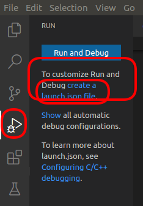
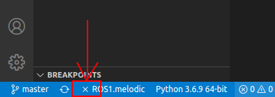
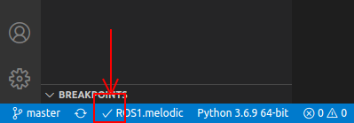
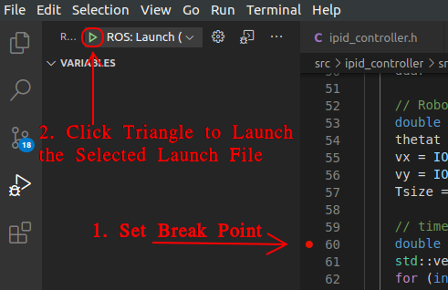

# Debug ROS using `VScode`

## Prerequisites
  - [VScode](https://code.visualstudio.com/)
  - [GDB](https://www.gnu.org/software/gdb/) 
  - [C/C++ extension from Microsoft for VSCode](https://github.com/microsoft/vscode-cpptools)

.     

  - [ROS extension from Microsoft for VSCode](https://marketplace.visualstudio.com/items?itemName=ms-iot.vscode-ros)

.     

  - Launch file for ROS node
 
## Create a launch.json

  - Open workplace roobt folder in VSCode 
  - Switch to ROS Extension page 

.   

  - Click the Button on the left side bar and click `create a launch.json file` under `Run and Debug` 

.   

  - Select `ROS` 

.   

  - Select `ROS:Launch` 

.   

  - Select package, for example `ipid_control` 

.      

  - Select launch file, for example `ipid_control_launch` 

.   

  - A `launch.json` will be generated 

.   

   
## Debug

### Compile
Compile the package with

```catkin_make -DCMAKE_BUILD_TYPE=Debug ```

This will set `-g` for debugging.

### A `roscore` need to be launched first. 
  - `roscore` not running
  
.   

  - `roscore` is running
  
.   

### Start Debuging

.   


## Annex

Use the [editor on GitHub](https://github.com/aaifox/ros_debug/edit/gh-pages/index.md) to maintain and preview the content for website in Markdown files.

View on [GitHub Page](https://aaifox.github.io/ros_debug/)
